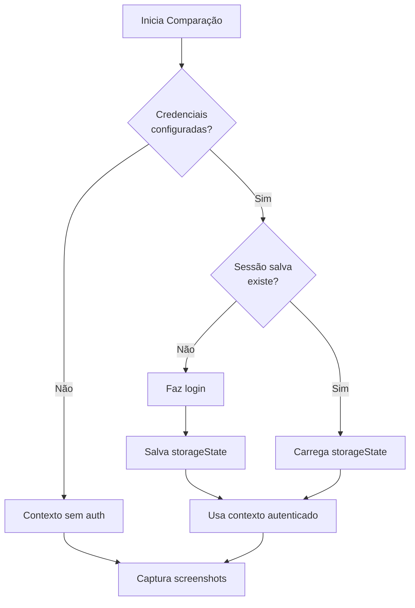

# 🔐 Autenticação no Liferay (Ambientes STG)

## 📋 Problema

Os ambientes GREEN e BLUE do Liferay STG exigem autenticação para visualização. A aplicação agora suporta **login automático** usando Playwright.

## ✅ Solução Implementada

### 1. Login Programático com Playwright
- ✅ Faz login automaticamente antes de capturar screenshots
- ✅ Salva sessão (cookies + localStorage) em `/tmp/auth/`
- ✅ Reutiliza sessão entre comparações (evita logins repetidos)
- ✅ Detecta automaticamente se credenciais estão configuradas

### 2. Persistência de Sessão

**Desenvolvimento:**
```
tmp/auth/liferay-stg-session.json
```

**Produção (Vercel):**
```
/tmp/auth/liferay-stg-session.json
```

⚠️ **Nota**: No Vercel, `/tmp` é volátil. A sessão persiste apenas durante a execução do serverless function. Para persistência entre deploys, considere usar Vercel Blob Storage ou S3.

## 🔧 Configuração

### Variáveis de Ambiente Obrigatórias

Adicione no **Vercel Dashboard** (Settings → Environment Variables):

```env
# URL da página de login do Liferay STG
LIFERAY_LOGIN_URL=https://seu-liferay-stg.com/c/portal/login

# Credenciais de uma conta de teste/serviço (SEM MFA!)
LIFERAY_USER=service.account@empresa.com
LIFERAY_PASS=sua-senha-segura

# Seletores CSS (opcionais - usa defaults se não informado)
LIFERAY_USER_SELECTOR=input[name="login"]
LIFERAY_PASS_SELECTOR=input[name="password"]
LIFERAY_SUBMIT_SELECTOR=button[type="submit"]
```

### Variáveis Opcionais (com defaults)

Se o Liferay usar seletores padrão, você só precisa configurar:
- `LIFERAY_LOGIN_URL`
- `LIFERAY_USER`
- `LIFERAY_PASS`

Os seletores têm valores padrão:
```js
LIFERAY_USER_SELECTOR → 'input[name="login"]'
LIFERAY_PASS_SELECTOR → 'input[name="password"]'
LIFERAY_SUBMIT_SELECTOR → 'button[type="submit"]'
```

## 🧪 Como Testar

### 1. Desenvolvimento Local

Crie `.env.local`:

```bash
LIFERAY_LOGIN_URL=https://seu-liferay-stg.com/c/portal/login
LIFERAY_USER=seu.usuario@empresa.com
LIFERAY_PASS=sua-senha
```

Execute:
```bash
npm run dev
```

Teste uma comparação - você verá nos logs:
```
🔐 Fazendo login no Liferay: https://...
✅ Login realizado com sucesso
💾 Sessão salva em: /tmp/auth/liferay-stg-session.json
```

Próximas comparações:
```
♻️  Reutilizando sessão salva do Liferay
```

### 2. Produção (Vercel)

1. **Configure as variáveis no Vercel**:
   - Acesse: https://vercel.com/[usuario]/envdiff/settings/environment-variables
   - Adicione cada variável
   - Marque: Production, Preview, Development

2. **Redeploy**:
   ```bash
   git commit --allow-empty -m "trigger: redeploy with auth vars"
   git push origin main
   ```

3. **Verifique logs**:
   - Vercel Dashboard → Deployments → View Function Logs
   - Procure por "🔐 Fazendo login no Liferay"

## 🔍 Como Funciona

### Fluxo de Autenticação



### Código Relevante

```typescript
// Tenta reutilizar sessão salva
await access(storagePath);
const state = JSON.parse(await readFile(storagePath, "utf8"));
context = await browser.newContext({ storageState: state });
```

```typescript
// Se não existir, faz login e salva
context = await browser.newContext();
const loginPage = await context.newPage();
await performLogin(loginPage);
await context.storageState({ path: storagePath });
```

## ⚠️ Requisitos da Conta

### ✅ Requisitos Obrigatórios

1. **Sem MFA/2FA**
   - A conta **NÃO** pode ter autenticação de dois fatores
   - Playwright não consegue resolver CAPTCHA ou códigos SMS

2. **Permissões Mínimas**
   - Apenas visualização das páginas STG
   - Não precisa ser admin

3. **Credenciais Estáticas**
   - Senha que não expire
   - Ou rotação manual quando expirar

### 🔐 Segurança

- ✅ Use uma **conta de serviço** dedicada
- ✅ **NUNCA** use credenciais pessoais
- ✅ Limite permissões ao mínimo necessário
- ✅ Rotacione senha periodicamente
- ✅ Use Vercel Secret Variables (nunca commite no código)

## 🚨 Troubleshooting

### Login falha com timeout

**Sintomas:**
```
Error: page.waitForNavigation: Timeout 30000ms exceeded
```

**Soluções:**
1. Verificar se URL de login está correta
2. Ajustar seletores CSS (podem ter mudado)
3. Aumentar timeout se rede estiver lenta
4. Verificar se não há redirecionamento adicional

### Sessão expira rapidamente

**Sintomas:**
```
♻️ Reutilizando sessão salva
Error: Page not authenticated
```

**Soluções:**
1. Liferay pode ter timeout de sessão curto
2. No Vercel, /tmp é limpo entre invocações (cold start)
3. Implementar persistência em S3/Blob Storage:

```typescript
// Pseudocódigo
const state = await s3.get("liferay-session.json");
if (state) {
  context = await browser.newContext({ storageState: state });
} else {
  // login e salvar em S3
}
```

### Seletores CSS não encontrados

**Sintomas:**
```
Error: page.fill: Element not found
```

**Soluções:**
1. Inspecione a página de login do Liferay
2. Encontre os seletores corretos:
   ```bash
   # Abra DevTools no navegador
   # Right-click → Inspect no campo de usuário
   # Copy → Copy selector
   ```
3. Configure as variáveis corretas:
   ```env
   LIFERAY_USER_SELECTOR=#_com_liferay_login_web_portlet_LoginPortlet_login
   LIFERAY_PASS_SELECTOR=#_com_liferay_login_web_portlet_LoginPortlet_password
   LIFERAY_SUBMIT_SELECTOR=.btn-primary
   ```

## 🎯 Alternativas (se login automático não funcionar)

### 1. Proxy Autenticado
Criar um serviço intermediário que mantém sessão humana:
```
User → EnvDiff → Proxy (com sessão) → Liferay STG
```

### 2. URLs Públicas de Preview
Pedir ao time de infra para expor endpoints específicos sem auth:
```
https://liferay-stg.com/preview/page-123?token=xyz
```

### 3. VPN + Whitelist IP
Configurar Vercel com IP fixo e whitelist no Liferay

### 4. Service Account com API
Se Liferay tiver API headless, usar token de API em vez de browser

## 📚 Referências

- [Playwright Authentication](https://playwright.dev/docs/auth)
- [Vercel Environment Variables](https://vercel.com/docs/projects/environment-variables)
- [Liferay Login Portlet](https://learn.liferay.com/w/dxp/installation-and-upgrades/securing-liferay/authentication-basics)

## 📝 Checklist de Implementação

- [x] Código de autenticação implementado
- [x] Suporte a storageState (reutilização de sessão)
- [x] Variáveis de ambiente documentadas
- [x] Fallback para execução sem auth
- [x] Logs informativos (🔐, ♻️, ⚠️)
- [ ] Configurar variáveis no Vercel
- [ ] Criar conta de serviço no Liferay STG
- [ ] Testar em produção
- [ ] (Opcional) Migrar storage para S3/Blob

---

**Status**: ✅ Código pronto - pendente configuração de credenciais
