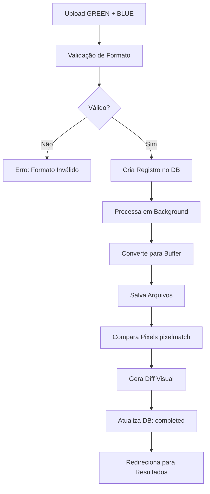

# 📸 Comparação Manual de Screenshots

## 🎯 Objetivo

Permite comparar **dois screenshots manualmente** sem precisar de autenticação ou URLs. Ideal para:

- ✅ Testar a ferramenta sem configurar autenticação do Liferay
- ✅ Comparar screenshots de diferentes fontes
- ✅ Validar mudanças visuais rapidamente
- ✅ Usar como alternativa quando URLs não estão disponíveis

## 🚀 Como Usar

### 1. Acesse a Comparação Manual

**URL**: `https://envdiff.vercel.app/compare/manual`

Ou clique no botão **"Comparação Manual"** na página inicial.

### 2. Faça Upload das Imagens

#### Screenshot GREEN
- Clique na área de upload à esquerda
- Selecione a imagem do ambiente GREEN
- Formatos aceitos: PNG, JPG, WebP

#### Screenshot BLUE
- Clique na área de upload à direita
- Selecione a imagem do ambiente BLUE
- Formatos aceitos: PNG, JPG, WebP

### 3. Ajuste a Sensibilidade (Opcional)

Use o slider para ajustar o threshold de detecção:

- **0.00** = Extremamente sensível (detecta até mínimas diferenças)
- **0.15** = Padrão (balanceado)
- **1.00** = Menos sensível (ignora pequenas variações)

### 4. Compare

Clique em **"Comparar Imagens"** e aguarde o processamento.

### 5. Veja os Resultados

Você será redirecionado para a página de resultados com:

- ✅ **Porcentagem de diferença** calculada
- ✅ **Áreas diferentes destacadas em vermelho** (diff visual)
- ✅ **Screenshots lado a lado** para comparação
- ✅ **Badge de status** (OK, Atenção, Alerta)

## 📊 Interpretação dos Resultados

### Badges

| Badge | Percentual | Significado |
|-------|-----------|-------------|
| 🟢 OK | < 1% | Imagens praticamente idênticas |
| 🟡 Atenção | 1-5% | Pequenas diferenças detectadas |
| 🔴 Alerta | > 5% | Diferenças significativas |

### Diff Visual

- **Áreas em vermelho** = Pixels diferentes
- **Áreas em cinza** = Pixels idênticos
- **Intensidade do vermelho** = Magnitude da diferença

## 🎨 Recursos

### Funcionalidades Implementadas

- ✅ Upload de duas imagens (drag & drop ou clique)
- ✅ Preview das imagens antes de comparar
- ✅ Ajuste de sensibilidade (threshold)
- ✅ Comparação pixel a pixel com pixelmatch
- ✅ Diff visual com destaque em vermelho
- ✅ Cálculo de porcentagem de diferença
- ✅ Mesma interface de resultados da comparação automática
- ✅ Suporte a múltiplos formatos de imagem

### Limitações Atuais

- ⏳ Imagens devem ter **mesmas dimensões**
- ⏳ Máximo 1 comparação por vez
- ⏳ Sem histórico de comparações manuais (usa mesmo DB)

## 🔧 Como Capturar Screenshots para Comparar

### Opção 1: Captura Manual (Chrome/Firefox)

1. Abra a página GREEN no navegador
2. Pressione `F12` (DevTools)
3. `Ctrl+Shift+P` (Command Palette)
4. Digite "Screenshot" → "Capture full size screenshot"
5. Salve como `green.png`
6. Repita para página BLUE → salve como `blue.png`

### Opção 2: Extensão "GoFullPage"

1. Instale: [GoFullPage](https://chrome.google.com/webstore/detail/gofullpage-full-page-scre/fdpohaocaechififmbbbbbknoalclacl)
2. Abra página GREEN → clique na extensão
3. Salve screenshot completo
4. Repita para página BLUE

### Opção 3: Ferramenta de Screenshot do SO

**Windows:**
- `Win + Shift + S` → Captura de área

**macOS:**
- `Cmd + Shift + 4` → Captura de área
- `Cmd + Shift + 3` → Captura de tela inteira

**Linux:**
- `Shift + PrintScreen` → Captura de área
- `PrintScreen` → Captura de tela inteira

## 💡 Casos de Uso

### 1. Teste Rápido da Ferramenta

Quer ver como o EnvDiff funciona sem configurar autenticação?

1. Tire dois screenshots de qualquer site
2. Faça um pequeno ajuste em um deles (mude cor, mova elemento)
3. Compare na ferramenta
4. Veja as diferenças destacadas

### 2. Validação Visual de Deploy

Antes e depois de um deploy:

1. Screenshot ANTES do deploy (GREEN)
2. Screenshot DEPOIS do deploy (BLUE)
3. Compare para validar mudanças visuais

### 3. Comparação Cross-Browser

Mesmo site em diferentes navegadores:

1. Screenshot no Chrome (GREEN)
2. Screenshot no Firefox (BLUE)
3. Compare para detectar inconsistências

### 4. Comparação de Versões

Diferentes versões de uma página:

1. Screenshot versão antiga (GREEN)
2. Screenshot versão nova (BLUE)
3. Compare para documentar mudanças

## 🎯 Fluxo Técnico



## 🛠️ Detalhes Técnicos

### API Endpoint

```
POST /api/compare/manual
Content-Type: multipart/form-data

Body:
- greenImage: File (PNG/JPG/WebP)
- blueImage: File (PNG/JPG/WebP)
- pixelThreshold: number (0-1)

Response:
{
  "id": "clxxx...",
  "status": "processing"
}
```

### Processamento

1. **Upload** → FormData com ambas as imagens
2. **Validação** → Verifica tipo de arquivo
3. **Banco de Dados** → Cria registro com status "processing"
4. **Background** → Processa comparação assincronamente
5. **Resultado** → Atualiza DB com status "completed"

### Storage

**Desenvolvimento:**
```
public/screenshots/{comparisonId}/
  ├── green-manual.png
  ├── blue-manual.png
  └── diff-manual.png
```

**Produção (Vercel):**
```
/tmp/screenshots/{comparisonId}/
  ├── green-manual.png
  ├── blue-manual.png
  └── diff-manual.png
```

Servido via: `/api/screenshots/{comparisonId}/{filename}`

## 🎨 Interface

### Página de Upload

- **Layout**: Grid 2 colunas (GREEN | BLUE)
- **Upload**: Drag & drop ou clique
- **Preview**: Thumbnail da imagem carregada
- **Controles**: Slider de sensibilidade
- **Botão**: "Comparar Imagens" (desabilitado até ambas carregadas)

### Página de Resultados

- **Mesma interface** da comparação automática
- **Tabs**: GREEN | BLUE | DIFF
- **Badge**: Status da comparação
- **Porcentagem**: Diferença calculada
- **Visualização**: Screenshots lado a lado

## 🔗 Navegação

```
Página Inicial
    ↓ (botão "Comparação Manual")
Página de Upload (/compare/manual)
    ↓ (após upload e comparação)
Página de Resultados (/comparisons/{id})
```

## 📝 Exemplos

### Exemplo 1: Comparação de Homepages

```bash
# Cenário
GREEN: Homepage em staging
BLUE: Homepage em produção

# Passos
1. Capturar full screenshot de ambas
2. Upload no /compare/manual
3. Threshold: 0.15 (padrão)
4. Comparar
5. Ver diferenças (provavelmente banners, datas, etc)
```

### Exemplo 2: Teste de Responsividade

```bash
# Cenário
GREEN: Desktop (1920px)
BLUE: Mobile (375px)

# Nota: Imagens devem ter mesmas dimensões!
# Redimensione ambas para mesma largura antes
```

### Exemplo 3: Validação de Bug Fix

```bash
# Cenário
GREEN: Antes do fix
BLUE: Depois do fix

# Resultado esperado
Diff deve mostrar APENAS a área corrigida em vermelho
```

## 🚀 Roadmap

### Próximas Melhorias

- [ ] Suporte a imagens com dimensões diferentes (resize automático)
- [ ] Histórico de comparações manuais na interface
- [ ] Exportar resultado em PDF/JSON
- [ ] Comparação de múltiplos screenshots (batch)
- [ ] Anotações/comentários no diff
- [ ] Compartilhamento de resultados (link público)

## 📚 Arquivos do Código

```
src/
├── app/
│   ├── compare/
│   │   └── manual/
│   │       └── page.tsx          # Interface de upload
│   └── api/
│       └── compare/
│           └── manual/
│               └── route.ts       # Processamento backend
```

## ✅ Checklist de Teste

Antes de usar em produção, teste:

- [ ] Upload de imagens PNG
- [ ] Upload de imagens JPG
- [ ] Upload de imagens WebP
- [ ] Validação de formato inválido
- [ ] Comparação com threshold baixo (0.05)
- [ ] Comparação com threshold alto (0.50)
- [ ] Preview correto das imagens
- [ ] Trocar imagem após upload
- [ ] Processamento e redirecionamento
- [ ] Visualização do diff em vermelho
- [ ] Porcentagem calculada corretamente

---

**Status**: ✅ Implementado e funcional

**Acesso Rápido**: [/compare/manual](https://envdiff.vercel.app/compare/manual)
